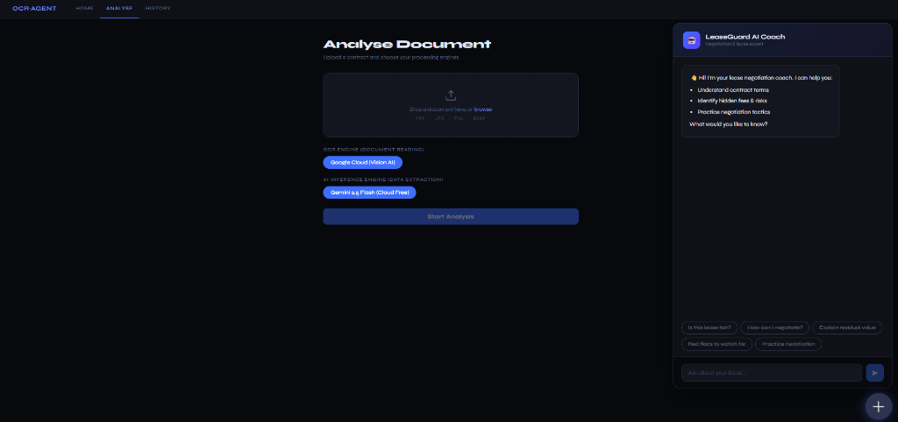
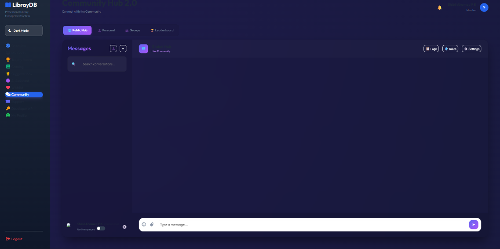

<p align="center">
  
</p>

<h1 align="center">🔍 LeaseGuardAI</h1>

<p align="center">
  <strong>Privacy-First AI-Powered Lease Contract Analyser & Negotiation Coach</strong>
</p>

<p align="center">
  <a href="https://github.com/ShibilAhamed701212/LeaseGuardAI/actions"></a>
  <a href="https://opensource.org/licenses/MIT"></a>
  
  
  
  
</p>

<p align="center">
  LeaseGuardAI is a privacy-first, full-stack application designed to demystify auto lease contracts. Users upload a PDF or image of their lease, and the system extracts key contract details, computes fairness ratings, highlights hidden risks, and provides actionable negotiation tips—all stored locally in your browser's IndexedDB.
</p>

---

<h2 align="center">📸 Visual Preview</h2>

<p align="center">
  
  
</p>

---

## 📋 Table of Contents

- [Overview](#overview)
- [Key Features](#-key-features)
- [Architecture](#architecture)
- [Project Structure](#project-structure)
- [Tech Stack](#tech-stack)
- [Prerequisites](#prerequisites)
- [Quick Start](#quick-start)
  - [1. Infrastructure (Docker)](#1-infrastructure-docker)
  - [2. Backend Setup](#2-backend-setup)
  - [3. Frontend Setup](#3-frontend-setup)
  - [4. Import n8n Workflow](#4-import-n8n-workflow)
- [Environment Variables](#environment-variables)
  - [Backend Configuration](#backend-configuration)
  - [Frontend Configuration](#frontend-configuration)
- [API Reference](#api-reference)
- [Core Services](#core-services)
- [Storage & Privacy Policy](#storage--privacy-policy)
- [Deployment](#deployment)
- [Monitoring & Diagnostics](#monitoring--diagnostics)
- [CI/CD Pipeline](#cicd-pipeline)
- [Contributing](#contributing)
- [License](#license)

---

## Overview

LeaseGuardAI empowers consumers to understand complex lease agreements before signing. The pipeline executes five distinct steps:

1. **OCR Extraction:** Scans physical images or PDF documents using Google Cloud Vision, Tesseract, or PaddleOCR.
2. **AI Contract Analysis:** Extracts structured values (monthly payment, term, residual value, fees, mileage limits, and penalties) via Gemini 2.5 Flash, Ollama, or OpenAI.
3. **Fairness Evaluation:** Automatically calculates a weighted score out of 100 based on financial ratios and penalty terms.
4. **Negotiation Guidance:** Compiles tailored pointers on how to negotiate unfavorable terms.
5. **Zero-Server Persistence:** Contract data is completely stored on the user's browser (IndexedDB). Files and results automatically expire and get deleted from the server.

---

## ✨ Key Features

<table>
  <thead>
    <tr>
      <th width="30%">Feature</th>
      <th>Details & Description</th>
    </tr>
  </thead>
  <tbody>
    <tr>
      <td><strong>🔍 Multi-Engine OCR</strong></td>
      <td>Support for Google Cloud Vision (native multimodal), Tesseract OCR, or PaddleOCR (best for complex tabulations).</td>
    </tr>
    <tr>
      <td><strong>🤖 Advanced AI Core</strong></td>
      <td>Utilizes Gemini 2.5 Flash as default engine, with support for local models (Ollama) and custom OpenAI API endpoints.</td>
    </tr>
    <tr>
      <td><strong>⚖️ Automated Scoring</strong></td>
      <td>Calculates overall contract fairness by assessing APR, penalty weightings, maintenance distribution, and acquisition fees.</td>
    </tr>
    <tr>
      <td><strong>🔐 True Privacy First</strong></td>
      <td>Document contents never persist in PostgreSQL. Temporary uploads to S3/MinIO and Redis cache clear after 24 hours or user cleanup.</td>
    </tr>
    <tr>
      <td><strong>💬 Interactive AI Coach</strong></td>
      <td>A floating chat widget (LeaseGuard Coach) powered by Gemini helps you ask questions, analyze risks, and practice negotiation tactics.</td>
    </tr>
    <tr>
      <td><strong>📊 Risk badge alerts</strong></td>
      <td>Instantly tags legal and financial risks into color-coded severity levels (Low / Medium / High).</td>
    </tr>
    <tr>
      <td><strong>🧠 Self-Healing Backend</strong></td>
      <td>Stuck processing jobs automatically fail and trigger background cleanup routines to ensure system reliability.</td>
    </tr>
  </tbody>
</table>

---

## Architecture

```
┌──────────────────────────────────────────────────────────────┐
│                        Browser (React)                        │
│  Upload → Poll Status → View Result → Chat with LeaseGuard   │
└────────────────────┬─────────────────────────────────────────┘
                     │ REST API
┌────────────────────▼─────────────────────────────────────────┐
│              Backend (Express / Node 18)                      │
│  /upload  /process  /status  /result  /cleanup  /chat        │
│                                                               │
│  ┌──────────────┐  ┌─────────────┐  ┌──────────────────┐    │
│  │ PostgreSQL   │  │   Redis     │  │  MinIO / S3      │    │
│  │ (job meta)   │  │ (queue +    │  │ (file storage,   │    │
│  │              │  │  results)   │  │  signed URLs)    │    │
│  └──────────────┘  └───────┬─────┘  └──────────────────┘    │
│                            │                                  │
│  ┌─────────────────────────▼──────────────────────────────┐  │
│  │            Background Worker (worker.ts)               │  │
│  │  LPOP queue → download file → OCR → AI → store result  │  │
│  └─────────────────────────────────────────────────────────┘  │
└──────────────────────────────────────────────────────────────┘
                     │ Webhook (optional)
┌────────────────────▼─────────────────────────────────────────┐
│                      n8n Workflow                             │
│  Validate payload → log → acknowledge (worker does the work) │
└──────────────────────────────────────────────────────────────┘
```

---

## Project Structure

```
ocr-agent/
│
├── backend/                        # Express API + background worker
│   ├── functions/
│   │   ├── index.ts                # App entry point & router initialization
│   │   ├── worker.ts               # Background queue processor
│   │   ├── upload/index.ts         # POST /upload
│   │   ├── process/index.ts        # POST /process (S3 validation & webhook trigger)
│   │   ├── status/index.ts         # GET /status/:job_id
│   │   ├── result/index.ts         # GET /result/:job_id
│   │   ├── cleanup/index.ts        # DELETE /cleanup/:job_id (garbage collector)
│   │   ├── chat/index.ts           # POST /chat (LeaseGuard conversational coach)
│   │   ├── debug.ts                # GET /debug (health diagnostics dashboard)
│   │   └── utils/
│   │       ├── postgresClient.ts   # PG connection pool & migration runner
│   │       ├── redisClient.ts      # Redis client wrapper & queue worker
│   │       ├── minioClient.ts      # S3 client helper
│   │       ├── n8nClient.ts        # n8n webhook helper
│   │       ├── logger.ts           # Structured logging and error capturing
│   │       └── errorHandler.ts     # Global uncaught exception handlers
│   ├── package.json
│   ├── tsconfig.json
│   └── firebase.json
│
├── frontend/                       # React SPA (Vite + TypeScript)
│   ├── src/
│   │   ├── App.tsx                 # Routing, navbar layout
│   │   ├── main.tsx                # Bootstrap React app & Sentry Setup
│   │   ├── pages/
│   │   │   ├── Home.tsx            # Interactive features home page
│   │   │   ├── Upload.tsx          # Upload console with progress tracker
│   │   │   ├── Result.tsx          # Fairness reports & tips UI
│   │   │   └── History.tsx         # Saved lease history (IndexedDB)
│   │   ├── components/
│   │   │   ├── chat/ChatWidget.tsx # Floating AI chat sidebar
│   │   │   ├── result/ResultCard   # Main result view cards
│   │   │   ├── upload/FileUploader # HTML5 Drag-and-drop handler
│   │   │   └── upload/ModelSelector# Engines dropdown configuration
│   │   ├── hooks/                  # Custom react hooks for API orchestration
│   │   ├── services/
│   │   │   ├── api.ts              # Fetch requests to backend routes
│   │   │   └── storage/            # Local IndexedDB persistence
│   ├── package.json
│   └── vite.config.ts
│
├── services/
│   ├── ai/                         # Optional standalone AI microservice
│   ├── ocr/                        # Optional Python OCR microservices
│   └── shared/                     # Shared Business Logic and Engines
│       ├── utils/
│       │   ├── fairnessEngine.ts   # Formulas for scoring calculations
│       │   ├── riskAnalyzer.ts     # Flag identification logic
│       │   └── negotiationEngine.ts# Actionable advice rules
│
├── infra/                          # Docker orchestration configurations
│   ├── docker/
│   └── postgres/
│
└── n8n/                            # n8n workflow backups
```

---

## Tech Stack

### Backend Infrastructure
* **Runtime:** Node.js (v18+)
* **Framework:** Express 4 (TypeScript 5)
* **Metadata Store:** PostgreSQL 17 (Job statuses and metadata only)
* **Message Queue / Cache:** Redis 7 (via `ioredis`)
* **Storage Provider:** MinIO / Any AWS S3-compatible service
* **AI & Parsing:** Google Generative AI SDK (Gemini 2.5 Flash), `pdf-parse`
* **Telemetry:** Sentry Node SDK

### Frontend Client
* **Core:** React 18 & TypeScript 5
* **Build System:** Vite 5
* **Routing:** React Router DOM v6
* **Database:** IndexedDB (via custom client storage services)
* **Telemetry:** Sentry React SDK

---

## Prerequisites

Ensure you have the following installed on your machine:
* **Node.js (v18 or v20)**
* **Docker & Docker Compose** (needed for running the local services stack)
* **PostgreSQL Native Command Line Interface** (Optional)
* A valid **Gemini API Key** ([Register at Google AI Studio](https://aistudio.google.com/app/apikey))

---

## Quick Start

### 1. Infrastructure (Docker)
Set up the backend components (Redis, PostgreSQL, MinIO, OCR workers, n8n, Ollama):
```bash
cd infra/docker
cp .env.example .env    # Fill in password values for services

# On Unix-based systems (Linux/macOS)
chmod +x setup.sh
./setup.sh

# On Windows (PowerShell)
.\setup.ps1
```
* MinIO Console: `http://localhost:9001`
* n8n Interface: `http://localhost:5678`

### 2. Backend Setup
Load the variables and run the Node server:
```bash
cd backend
cp .env.example .env    # Configure your PG, Redis, and Gemini Credentials
npm install
npm run dev
```
The server will boot on **port 10000** (`http://localhost:10000`). If downstream services are missing, the server launches in **diagnostic mode** automatically.

### 3. Frontend Setup
Install dependencies and run Vite:
```bash
cd frontend
cp .env.example .env    # Make sure VITE_API_BASE_URL points to localhost:10000
npm install
npm run dev
```
Open **`http://localhost:5173`** to access the user dashboard.

### 4. Import n8n Workflow
1. Navigate to n8n at `http://localhost:5678`
2. Go to **Workflows → Add → Import from File**
3. Select `n8n/workflows/ocr_pipeline.json` and activate it.

---

## Environment Variables

### Backend Configuration (.env)
```env
# Database Credentials
PG_HOST=localhost
PG_PORT=5432
PG_DATABASE=ocr_agent
PG_USER=postgres
PG_PASSWORD=postgres
PG_SSL=false

# Caching & Queue
REDIS_HOST=localhost
REDIS_PORT=6380
REDIS_PASSWORD=
REDIS_TLS=false

# Object Storage (MinIO)
MINIO_ENDPOINT=localhost
MINIO_PORT=9000
MINIO_USE_SSL=false
MINIO_ACCESS_KEY=minioadmin
MINIO_SECRET_KEY=minioadmin
MINIO_BUCKET=ocr-agent

# Gemini Credentials
GEMINI_API_KEY=AIzaSy...

# Port Configuration
PORT=10000
```

---

## API Reference

| Method | Endpoint | Description | Payloads / Request Body |
| :--- | :--- | :--- | :--- |
| **POST** | `/upload` | Stream a contract file to storage. | `multipart/form-data` containing `file` & `user_id` |
| **POST** | `/process` | Launch the OCR & AI analysis worker. | `{ "job_id": "uuid", "ocr": "google_cloud", "ai": "gemini" }` |
| **GET** | `/status/:job_id` | Get the current step of a job. | Returns status (`uploaded`, `processing`, `completed`, `failed`) |
| **GET** | `/result/:job_id` | Pull completed analysis result. | Returns JSON details (fairness engine metrics, risks, Vin) |
| **DELETE**| `/cleanup/:job_id` | Terminate database entries & delete files. | Deletes local Redis cache, PostgreSQL metadata status & MinIO files |
| **POST** | `/chat` | Chat with LeaseGuard Coach. | `{ "message": "query", "history": [], "contract_context": {} }` |
| **GET** | `/health` | Fetch dependencies connectivity statuses. | Simple JSON showing connection status to Postgres, Redis, S3 |

---

## Core Services

### ⚖️ The Fairness Engine
Computes a weighted overall fairness score based on critical parameters extracted by the LLM:
* **Interest Rate (APR):** Higher lease rates decrease the score.
* **Capitalized Cost:** The closer the lease price to market MSRP, the higher the score.
* **Mileage Limitations:** Low annual caps (e.g., < 10k miles/year) accompanied by high excess charges decrease the score.
* **Maintenance & Insurance Responsibilities:** Clauses shifting typical lessor maintenance obligations onto the lessee result in penalty adjustments.

### 🔐 Storage & Privacy Policy
* **Zero Persistence on Server:** LeaseGuardAI never stores contract text, PII, or vehicle details on persistent server disks. PostgreSQL stores only audit timestamps and status states.
* **Temporary Cache:** MinIO buckets and Redis cache keys live with a strict **24-hour Time-to-Live (TTL)**. Pushing the cleanup button removes the storage entries immediately.
* **Local Sandboxing:** Complete analysis results are saved in the client-side IndexedDB sandbox, preventing data leaks.

---

## Deployment

### Backend to Render
A `render.yaml` template is pre-configured for deployment.
1. Connect your repository to Render.
2. Link Redis and PostgreSQL add-ons.
3. Configure the environment variables in your Render Dashboard.

### Frontend to Firebase Hosting
Deploy your static React assets to Firebase:
```bash
cd frontend
npm run build
firebase login
firebase deploy --only hosting
```
*Vite build checks and automated test runs execute via GitHub Actions on all master PRs.*

---

## Monitoring & Diagnostics
* **Sentry Logging:** Monitored on both client and server layers.
* **Diagnostic Route:** Visit `GET /diagnostic` or `GET /debug` on the backend server for memory configurations, queue sizes, and predicted error patterns.
* **Console Debugging:** Access the custom debug interface directly from the browser by typing `window.__DEBUG__.getSystemStatus()` in the developer console.

---

## Contributing

1. Fork the repository and create your branch: `git checkout -b feat/my-improvement`
2. Add your code changes and make sure tests run clean: `npm run build`
3. Open a pull request against `main` for review.

---

## License

This project is licensed under the MIT License - see the [LICENSE](LICENSE) file for details.